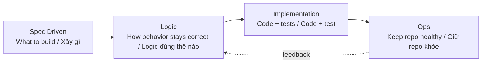
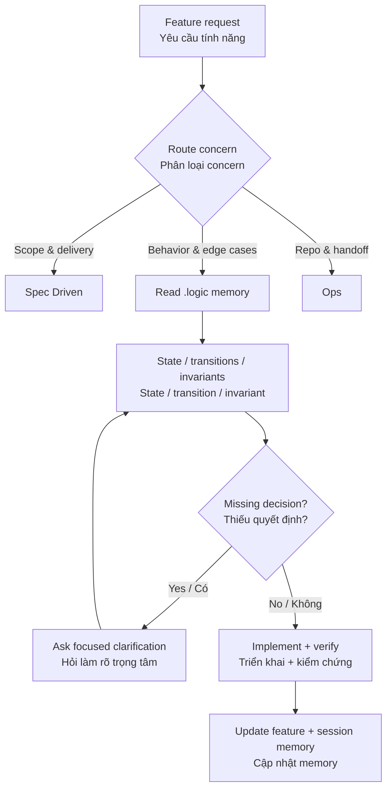
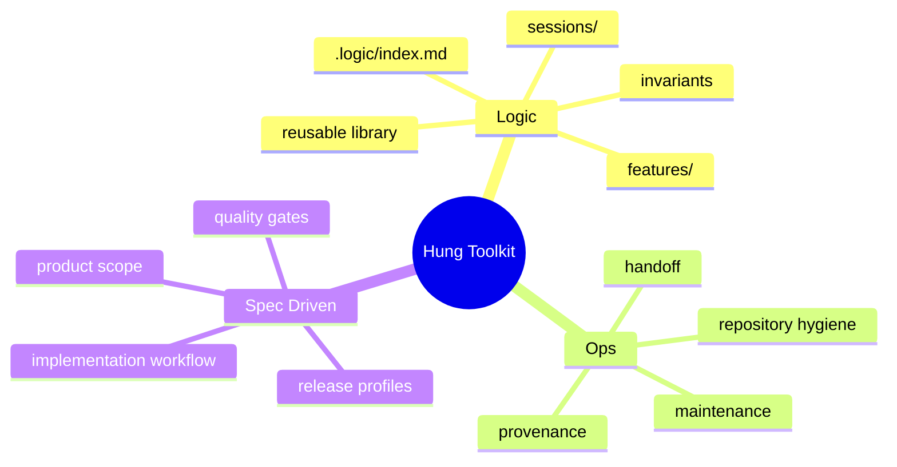
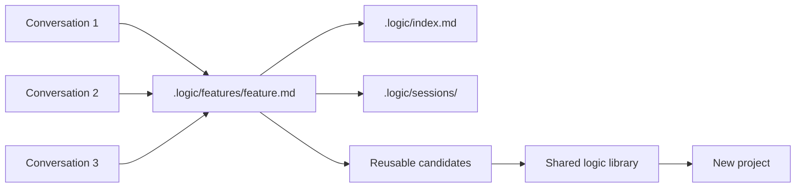

# Hung Toolkit

> A durable development context for coding agents: define the product, reason about behavior, and keep the repository healthy across sessions.

> Bộ ngữ cảnh phát triển bền vững cho coding agent: xác định sản phẩm, suy luận behavior và duy trì sức khỏe repository xuyên suốt nhiều phiên làm việc.

Hung Toolkit packages three complementary development toolkits in one distributable bundle. / Hung Toolkit đóng gói ba toolkit bổ trợ cho nhau:

1. **Logic** — behavioral completeness, persistent logic memory, state transitions, invariants, and reusable logic patterns. / Tính đầy đủ của behavior, logic memory xuyên hội thoại, state transition, invariant và pattern tái sử dụng.
2. **Ops** — repository hygiene, provenance, documentation integrity, maintenance, and handoff readiness. / Vệ sinh repository, provenance, tài liệu, bảo trì và khả năng bàn giao.
3. **Spec Driven** — product specifications, implementation workflow, quality gates, and release profiles. / Đặc tả sản phẩm, workflow triển khai, quality gate và profile release.

The bundle preserves the three toolkits as independent components. It does not merge their checklists or create a second source of truth.

```text
hung-toolkit/
├── components/
│   ├── Logic/
│   ├── Ops/
│   └── Spec-Driven/
└── bundle.json
```

## Ownership flow

```text
Spec Driven → Logic → implementation → Ops
```



Use Spec Driven to define what to build, Logic to preserve behavioral correctness across conversations and projects, and Ops to keep the repository maintainable and handoff-ready. / Dùng Spec Driven để xác định cần xây gì, Logic để giữ behavior đúng xuyên các cuộc hội thoại và dự án, Ops để duy trì repository.

## Start here

Coding agents should read [AGENTS.md](AGENTS.md) before making changes. It defines routing, the conversation protocol, memory rules, and completion evidence.

For a detailed guide, read [docs/agent-integration.md](docs/agent-integration.md). For the persistent logic memory, read [docs/logic-memory.md](docs/logic-memory.md).

## Quickstart

### 1. Add the bundle to a project

Keep this repository as the toolkit source and create a project-local memory directory:

```text
your-project/
├── .toolkit/
├── .logic/
├── .spec-product/
└── .steward/
```

Copy `AGENTS.md` to the project root or merge its instructions into the project's existing agent instructions. The agent must be able to discover the toolkit before it starts feature work.

### 2. Start a feature conversation

Use a prompt such as:

```text
Use Hung Toolkit for this feature. Read AGENTS.md and the .logic memory first.
Analyze the affected behavior, states, transitions, invariants, dependencies,
failure paths, and open questions before proposing implementation.
```

The agent should recover existing records, ask only behavior-changing questions, update durable memory, implement, verify, and leave a session checkpoint.

### 3. Continue across conversations

When returning to an old feature, refer to the feature name rather than pasting the whole history:

```text
Continue the checkout feature using the existing Hung Toolkit memory.
Read .logic/index.md, the checkout feature record, and the latest session checkpoint.
Report current state and unresolved decisions before editing code.
```

### 4. Scan for reusable logic

```powershell
python components/Logic/scripts/scan_logic.py `
  --project D:\path\to\your-project `
  --write-report
```

Review `.logic/reusable-candidates.md`. Promote only generalized rules with evidence into `components/Logic/reusable-library/index.md`.

## What happens during a conversation

```text
request → route → recover memory → analyze behavior → clarify
        → update logic records → implement → verify → checkpoint
```



The toolkit does not silently invent missing behavior. If an unresolved decision changes authorization, persistence, state transitions, retry semantics, side effects, or user-visible behavior, the agent asks the user first.

## What each component does

| Component | Use it for | Does not own |
|---|---|---|
| Logic | states, transitions, invariants, edge cases, behavior memory, reusable patterns | product scope, repository hygiene |
| Ops | repository hygiene, provenance, maintenance, handoff readiness | feature behavior, product specifications |
| Spec Driven | requirements, delivery workflow, profiles, release gates | cross-conversation logic memory |

The components may be used together, but their artifacts remain separate.



## Logic memory / Logic memory xuyên hội thoại



The memory stores durable behavior, not raw transcripts. / Memory lưu behavior bền vững, không lưu toàn bộ transcript.

## Minimum completion report

Before claiming a feature is complete, the agent should report:

- affected states and legal/forbidden transitions;
- important invariants and verification evidence;
- dependencies and failure/retry behavior;
- open assumptions or unresolved questions;
- memory files updated;
- tests/checks run and known gaps.

## Tài liệu / Documentation

- [Agent instructions / Hướng dẫn cho agent](AGENTS.md)
- [Agent integration / Tích hợp vào coding agent](docs/agent-integration.md)
- [Logic memory / Logic memory](docs/logic-memory.md)
- [Usage examples / Ví dụ sử dụng](docs/usage-examples.md)

## Installation

Install each component using its own instructions. The component boundaries are intentional:

- `components/Spec-Driven/SKILL.md`
- `components/Logic/SKILL.md`
- `components/Ops/README.md`

For reusable logic discovery, use:

```powershell
python components/Logic/scripts/scan_logic.py --project D:\path\to\project --write-report
```

The reusable logic library is bundled at `components/Logic/reusable-library/`.
